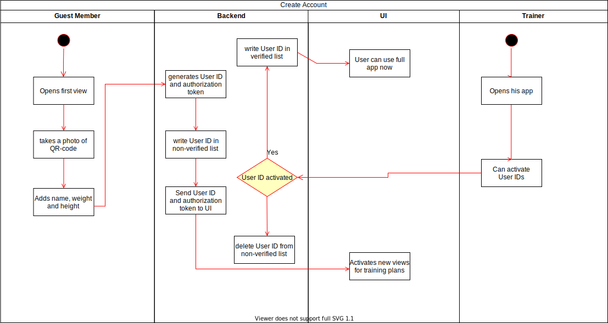
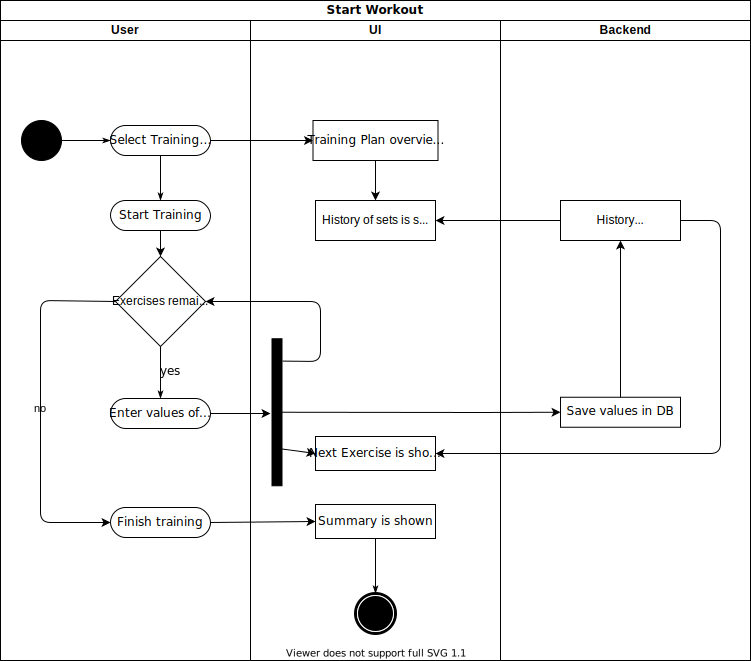

# FitComDoc
Documentation for https://github.com/SuperLonci/FitCom

## Business Roles
Can be found [here](business_roles.md)

## [SRS](srs/SRS.md)

## UML Diagrams
Account creation:

Start Workout:

## Database
An overview over the tables is [done in sql](database/databse_tables.sql). More will follow.