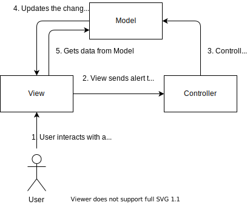
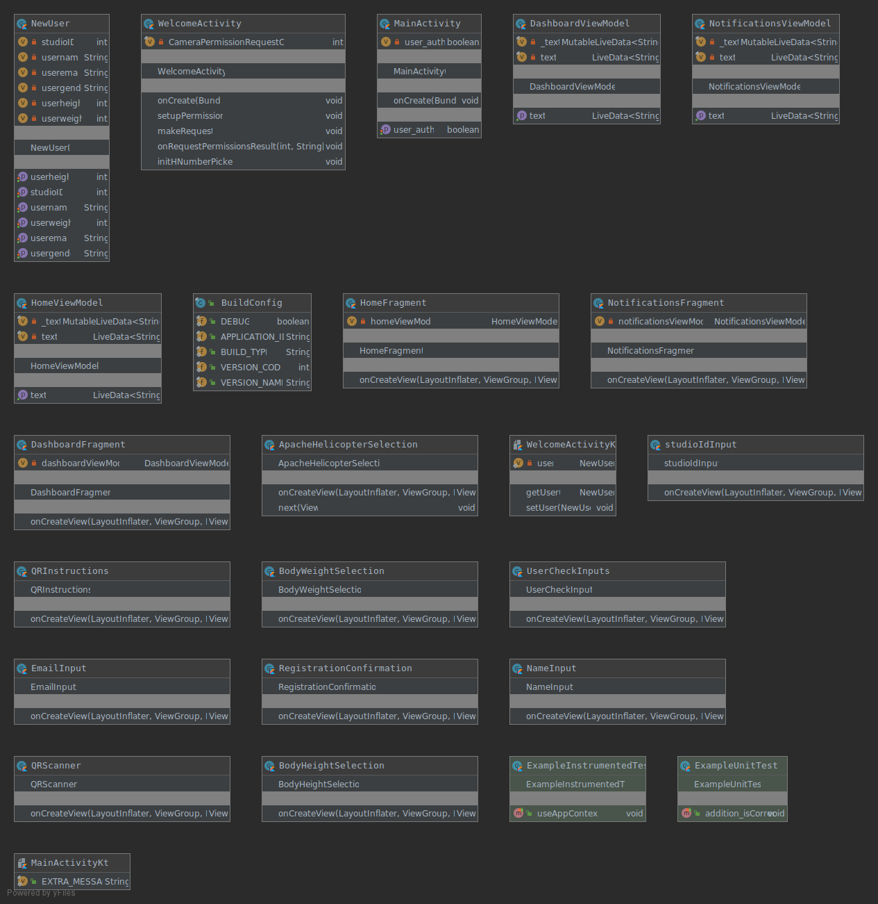
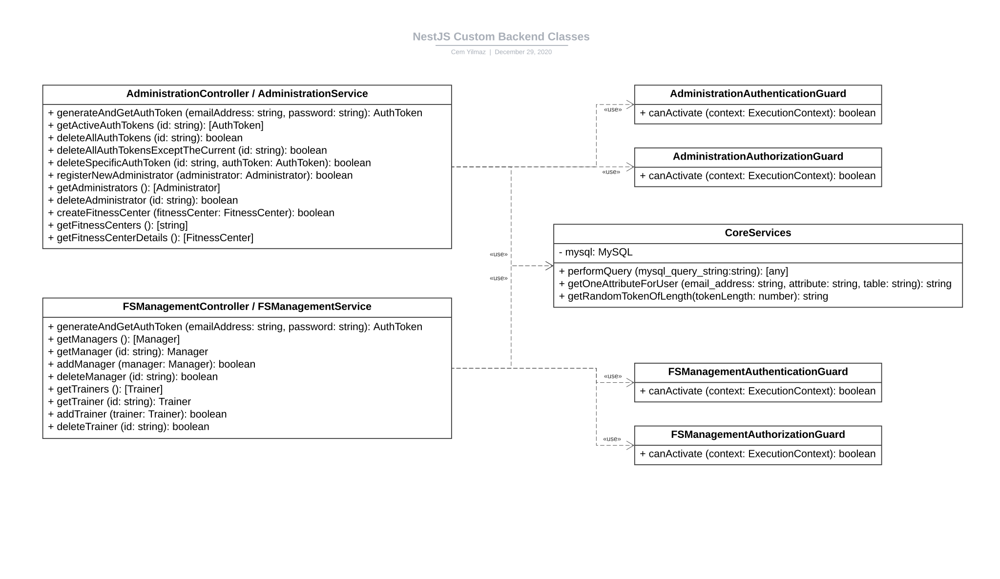

# Software Architecture Document

## Table of Contents 
1. [Introduction](#1-introduction)
    + [1.1 Purpose](#11-purpose)
    + [1.2 Scope](#12-scope)
    + [1.3 Definitions, Acronyms and Abbreviations](#13-definitions-acronyms-and-abbreviations)
    + [1.4 References](#14-references)
    + [1.5 Overview](#15-overview)
2. [Architectural Representation](#2-architectural-representation)
3. [Architectural Goals and Constraints](#3-architectural-goals-and-constraints)
4. [User-Case-View](#4-use-case-view)
    + [4.1 Use-Case Realizations](#41-use-case-realizations)
5. [Logical View](#5-logical-view)
    + [5.1 Overview](#51-overview)
    + [5.2 Architecturally Significant Design Packages](#52-architecturally-significant-design-packages)
6. [Process View](#6-process-view)
7. [Deployment View](#7-deployment-view)
8. [Implementation View](#8-implementation-view)
    + [8.1 Overview](#81-overview)
    + [8.2 Layers](#82-layers)
9. [Data View](#9-data-view)
10. [Size and Performance](#10-size-and-performance)
11. [Quality](#11-quality)

## 1. Introduction 
### 1.1 Purpose
This document provides a comprehensive architectural overview of the system, using a number of different architectural views to depict different aspects of the system.  
It is intended to capture and convey the significant architectural decisions which have been made on the system.

### 1.2 Scope
The SAD describes the technical architecture of FitCom. An UML for frontend and backend, the database-schema and the use-cases are listed.  

### 1.3 Definitions, Acronyms and Abbreviations
| Abbrevation | Description                            |
| ----------- | -------------------------------------- |
| ASAP        | As soon as possible                    |

### 1.4 References

### 1.5 Overview
_This subsection should describe what the rest of the Software Architecture Document contains and explain how the Software Architecture Document is organized._
## 2. Architectural Representation
In the following diagram you can see our our MVC-Architecture which looks as follows:

## 3. Architectural Goals and Constraints
We are implementing our Android App basend on the MVC-architecture. We are working on making the implementation even clearer, because so far we only make partial use of the models.

### Backend
We decided to implement our backend with nestJS. We decided to use nestJS because our web-frontend will be implemented with Angular. Angular and NestJS will be implemented with TypeScript and they have the same architectural design patterns so we think it's the best choice to learn both most effective.

### Frontend
We will implement our app in Android and IOS.

## 4. Use-Case View

### 4.1 Use-Case Realizations
Our other use-cases are linked in our [SRS](SRS.md)
## 5 Logical View
### 5.1 Overview
In this section you will get an overview of our classes in our frontend and backend.
### Frontend

### Backend

### 5.2 Architecturally Significant Design Packages
Here you can find our Backend-Architecture. NestJS uses a stream lined architecture.

## 6. Process View
## 7. Deployment View
Our application is deployed as an APK. The application can be run on the android devices with versions greater than 4.0.
## 8. Implementation View
### 8.1 Overview
### 8.2 Layers
## 9. Data View
Our data will be stored in a MariaDB. To get a better view of our data view, you can find a more detailed diagram [here](../database/FitComDB.pdf).
## 10. Size and performance
Training plans can be created in the app. These are stored both locally and in the database. It is not possible to estimate how large the storage space will be yet. This will be possible when the creation of the training plans is programmed.
## 11. Quality
Privacy is an important point in our app. We do not store confidential user data like full names. We also rely on passwordless login.
